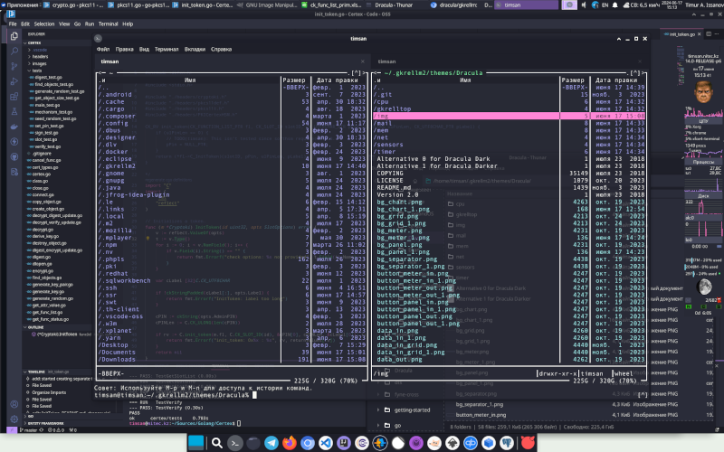
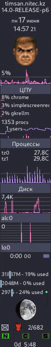

# Dracula Theme for GKrellm 2

> A dark theme for [GKrellM](http://gkrellm.srcbox.net/) and many more.

|  |  |
|:-----------------------------------:|:-------------------------------------:|
| Dark                                | Darker |

|  |  |
|:-----------------------------:|:-------------------------------:|
| Dark                          | Darker |

> Based on the [Breeze Theme](https://github.com/phd/breeze-gkrellm-theme)

## Install

All instructions can be found at [draculatheme.com/gkrellm](https://draculatheme.com/gkrellm).

## Useful links

- [Dracula](https://draculatheme.com/)
- [GKrellM](http://gkrellm.srcbox.net/)
- [Breeze](https://github.com/phd/breeze-gkrellm-theme)

## Team

This theme is maintained by the following person(s) and a bunch of [awesome contributors](https://github.com/dracula/foobar/graphs/contributors).

|  |
| --------------------------------------------------------------------------------------- |
| [timsan7sk](https://github.com/timsan7sk)                                               |

## Community

- [Twitter](https://twitter.com/draculatheme) - Best for getting updates about themes and new stuff.
- [GitHub](https://github.com/dracula/dracula-theme/discussions) - Best for asking questions and discussing issues.
- [Discord](https://draculatheme.com/discord-invite) - Best for hanging out with the community.

## License

[MIT License](./LICENSE)
