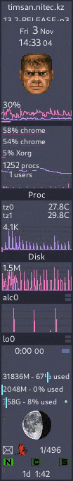

# Dracula Theme for GKrellm 2

> A dark theme for [Atom](http://atom.io/), [Alfred](http://www.alfredapp.com/), [Emacs](https://www.gnu.org/software/emacs/), [Highlight.js](https://highlightjs.org/), [Hyper](https://hyper.is/), [iTerm](http://www.iterm2.com/), [JetBrains](https://www.jetbrains.com/), [Pygments](http://pygments.org/), [Slack](http://slack.com), [Sublime Text](http://www.sublimetext.com/3), [TextMate](http://macromates.com/), [Terminal.app](http://www.apple.com/osx/apps), [Vim](http://www.vim.org/), [Xcode](https://itunes.apple.com/us/app/xcode/id497799835), [Zsh](http://www.zsh.org/), [GKrellM](http://gkrellm.srcbox.net/) and many more.

> Based on the [Breeze Theme](https://github.com/phd/breeze-gkrellm-theme)

## Install

All instructions can be found at [draculatheme.com/GKrellM](https://draculatheme.com/GKrellM).

## Screenshot

## Links

- [Dracula](https://draculatheme.com/)
- [GKrellM](http://gkrellm.srcbox.net/)
- [Breeze](https://github.com/phd/breeze-gkrellm-theme)

## Community

- [Twitter](https://twitter.com/draculatheme) - Best for getting updates about themes and new stuff.
- [GitHub](https://github.com/dracula/dracula-theme/discussions) - Best for asking questions and discussing issues.
- [Discord](https://draculatheme.com/discord-invite) - Best for hanging out with the community.

## License

[MIT License](./LICENSE)